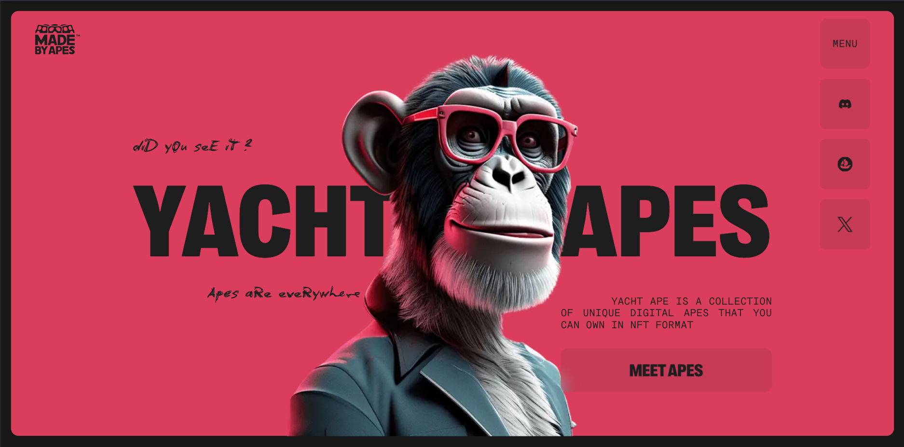
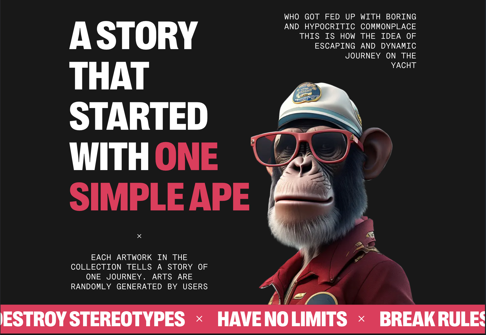
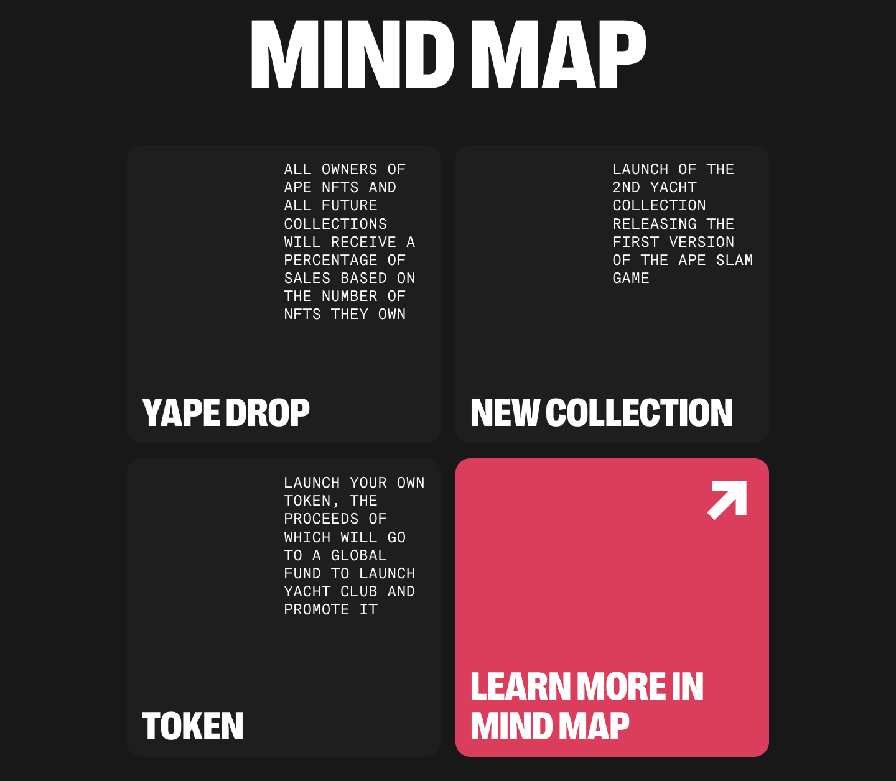
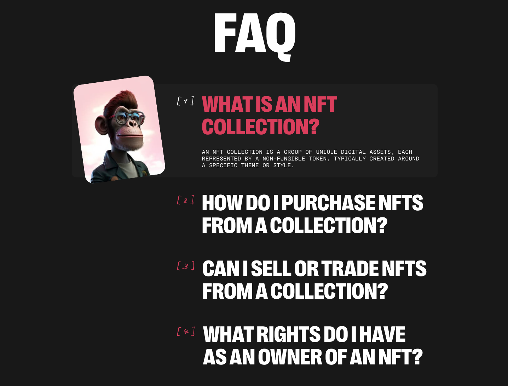
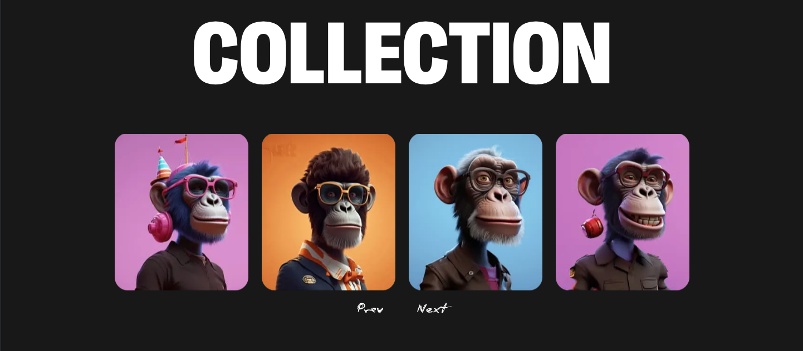
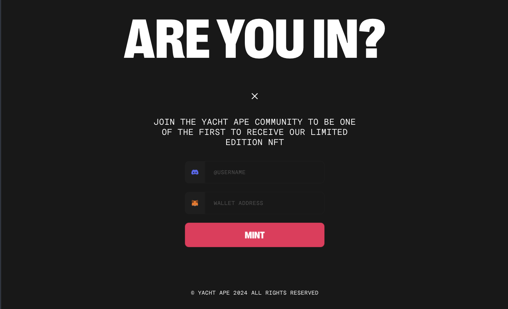
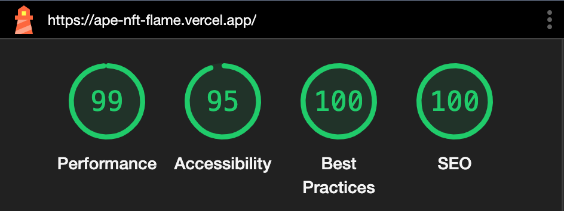

# Ape NFT

Welcome to the Yacht Ape NFT Collection, where you can own unique digital apes in NFT format, each artwork telling a story of a journey. This README provides an overview of the collection and its features.
Features
Unique digital ape artworks
Owners receive a percentage of sales
Upcoming releases: new collection, Ape Slam Game, global fund token
FAQ section explaining NFT collections, purchasing, selling, and owner rights
Getting Started
Visit Yacht Ape NFT Collection
Explore the collection and upcoming releases
Join the Yacht Ape community to receive limited edition NFTs
Support
For any questions or assistance, contact us at Yacht Ape Support

Thank you for being a part of the Yacht Ape NFT Collection community!

# Sections of the site

# Lighthouse

# Technologies used

HTML5, CSS3, JavaScript, React, Notiflix, React Hook Form, React Responsive, Styled Components, Swiper, Yup
